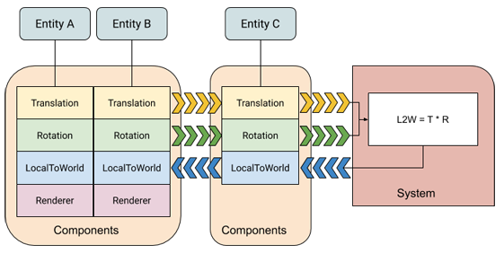

## ECS : Entity Component System

> Have you heard about : **Entity Component System (ECS)** for Game Development?

The ECS pattern is a recent industry standard for game development, it's concept
is to decompose game entities into "bricks" kind of like legos, so you can assemble
things in a easier way and avoid confusion.

The **Entity Component System (ECS)** is a modern software design pattern.

It is commonly used in game development to manage and organize game objects,
their behavior, and their data. 
It is designed to improve code performance, scalability,
and flexibility by separating the game's logic into distinct components and entities.

Key Components of ECS are:

1. **Entities**: In ECS, an entity represents a game object or an abstract entity in your game world. An entity is essentially a unique identifier, often just an integer or a handle, that is used to group and manage related components. Entities themselves don't contain any behavior or data; they serve as a way to assemble components.

2. **Components**: Components are the building blocks of an ECS system. Each component represents a single, self-contained piece of data and behavior. For example, in a 2D game, you might have components for position, sprite rendering, physics, and more. Components do not have any logic themselves; they are just containers for data.

3. **Systems**: Systems are responsible for defining the behavior and operations performed on entities that have specific combinations of components. Systems process entities based on the components they contain, and they can perform various tasks such as updating the physics simulation, rendering objects, handling input, and more. Systems are typically where the game's logic resides.

In summary a **component** is a collection of field values.

An **entity** is a **container of components**

A **system** is a part of the game logic, and have access to **both entities and components** 

To provide a visual description:

Image credit: 
<https://docs.unity3d.com/Packages/com.unity.entities@0.1/manual/ecs_core.html>

Let's explore ECS through an example: a role-playing game (RPG) where characters roam a virtual world. 
We'll consider two types of entities: "Player" and "NPC."

### Components :

Stats Component: Health points (HP), attack power, defense, and other attributes that define a character's abilities.

Position Component: The character's coordinates in the game world.

Control Component: The possible controls in the game world

### Entities:

Player Entity: An entity representing the player character. 
It contains Stats, Position and Control components.

NPC Entity: Represents non-playable characters in the game. 
It also contains Stats and Position components.

### Systems:

Rendering System: Responsible for drawing characters on the screen based on their Graphics components.

Collision Detection System: Detects collisions between entities in the game world. 
For example, it can determine if the player character collides with an NPC or an obstacle.

Combat System: Handles combat-related logic, including attacks, damage calculation, and health point updates based on the Stats components.

Movement System: Manages character movement based on their Position components and velocity. For example, it moves characters in response to player input or AI.

