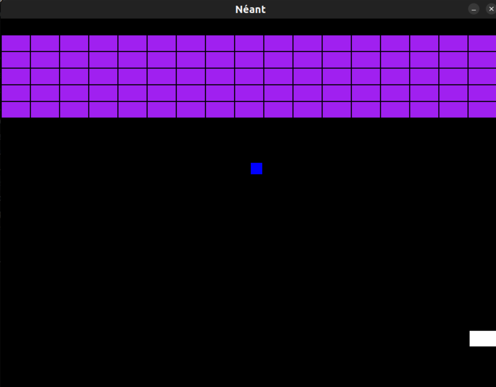
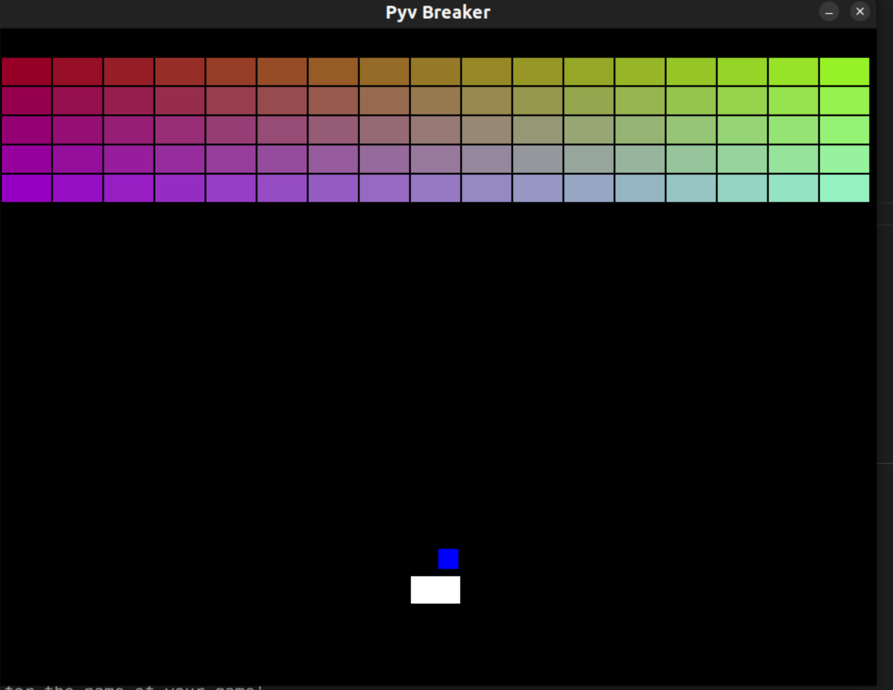

# Tutorial Breaker

This tutorial is here to help you create a block breaker type game from scratch.

This tutorial can also be used as a nice base to understand and experiment with the ECS pattern.

Note that the game in its final state is already available in the `pyved-engine` in the `pyv-cli`.


If you need further help for using PYV,
you can always refer to the
[**pyved-engine full docs homepage**](https://gaudiatech.github.io/pyved-engine/).


## Step 0. Getting Started

### Either Download the init, or just the template

If you want to build upon the foundation of the breaker template, you can download it by doing the following

```shell
pyv-cli init myGame
pyv-cli play myGame
```
And choose the Breakout template.

Note that this tutorial won't focus on building upon the foundation, instead the focus is on how to build on nothing and manage to create such a game.

So for this, we will choose the empty template instead.

Your folder should look something like this.

    .
    └── YourBundleName/
        ├── cartridge/
        │   ├── __pycache__/
        │   ├── gamedef.py
        │   ├── __init__.py
        │   ├── metadat.json
        │   └── pimodules.py
        ├── __pycache__/
        ├── __init__.py
        ├── vm.py
        └── vmslateL.py


## Step 1 : Create the necessary files for the ECS 

As of now, all of the files used in an ECS configuration aren't auto generated, this might change in the future, but since you're here to learn everything on how to create a game using Pyved and ECS, let's get into it.

Go inside `cartridge` and create the following file, they'll be useful later :

- shared.py
- systems.py
- world.py

These files will store nearly all of your ECS code.

## Step 2 : Creating the foundations

In this part, you will learn how to create your first entities and draw them on your screen.

### Creation of Archetypes and Entities

First, let's create all of our constants in our `shared.py` :

```py
import random


screen = None
blocks_pop = None

# (Size of break-out blocks)
BLOCK_W = 54
BLOCK_H = 30
BLOCK_SPACING = 2
WALL_X, WALL_Y = 4, 80
PLAYER_SPEED = 10

# ball-related
BALL_INIT_POS = 480, 277
BALL_SIZE = 22
```
We will use all of those constants laters, but they are important.


Secondly we will create all of our entities, let's head inside `gamedef.py`

``` py
from . import pimodules
from . import shared
from . import systems
from .world import world

pyv = pimodules.pyved_engine
@pyv.declare_begin
def init_game(vmst=None):
    pyv.init(wcaption='Néant')
```

Let's create our archetypes, this is how we will create the different entities : 

```py
    pyv.define_archetype('player', (
        'speed', 'controls', 'body'
    ))
    pyv.define_archetype('block', ('body', ))
    pyv.define_archetype('ball', ('body', 'speed_Y', 'speed_X'))
```

We can now go into `world.py`, to create our entities :

```py
from . import shared
from . import pimodules
pyv = pimodules.pyved_engine

pygame = pyv.pygame


class world:

    def create_player():
        player = pyv.new_from_archetype('player')
        pyv.init_entity(player, {
            'speed': 0.0, 
            'controls':{'left': False, 'right': False},
            'body': pygame.rect.Rect(900,600, shared.BLOCK_W, shared.BLOCK_H)
        })

```

We are creating a create_player function, this will create the entities with our default settings, we will do the same for every entity present in our game.

We give it, a speed, some controls, here we only give it left and right, as we don't need other directions.

And finally a body, so that our player have a hitbox.

```py
    def create_ball():
        ball = pyv.new_from_archetype('ball')
        pyv.init_entity(ball, {
            'speed_X' :random.uniform(-3.0, 3.0), 
            'speed_Y': 5.0, 
            'body': pygame.rect.Rect(shared.BALL_INIT_POS[0],shared.BALL_INIT_POS[1], shared.BALL_SIZE, shared.BALL_SIZE)
        })
```

We will create our ball too, we will keep the same logic, and create, it needs a speed to move, and a hitbox to detect collisions.


```py
def create_blocks():
        bcy = 0 
        LIMIT = 960/(shared.BLOCK_W + shared.BLOCK_SPACING)
        for row in range(5):
            bcy = bcy+shared.BLOCK_H + shared.BLOCK_SPACING
            bcx = -shared.BLOCK_W
            for column in range(round(LIMIT)):
                bcx = bcx +shared.BLOCK_W + shared.BLOCK_SPACING
                rrect = pygame.rect.Rect(0 + bcx, 0 + bcy, shared.BLOCK_W, shared.BLOCK_H)

                pyv.init_entity(pyv.new_from_archetype('block'),{
                    'body': rrect
                })
```

Here the code is a bit different, since there's more than one block, we will loop over it to generate as many entity as needed.

Here we fill the screen from left to right, and on 5 row with blocks.

We can now head back into `gamedef.py` and finalise the creation of our entities.


```py
@pyv.declare_begin
def init_game(vmst=None):
    pyv.init()
    pyv.define_archetype('player', (
        'speed', 'controls', 'body'
    ))
    pyv.define_archetype('block', ('body', ))
    pyv.define_archetype('ball', ('body', 'speed_Y', 'speed_X'))
    world.create_player()
    world.create_ball()
    world.create_blocks()
    pyv.bulk_add_systems(systems)
```
Here we added the call to the different functions we made in the `world.py`, so that now, when we launch our game, we create actual entities instead of just their archetypes.

As for the line `pyv.bulk_add_systems(systems)` we will get back to it soon.

### Creating systems

The systems are an essentiel part of the ECS, it's basically all of the logic happening in the game.


Let's head inside `systems.py` :

```py
from . import shared
from . import pimodules
pyv = pimodules.pyved_engine
pyv.bootstrap_e()

__all__ = [

    'gamectrl_sys'
]

def gamectrl_sys(entities, components):
    pg = pyv.pygame
    for ev in pg.event.get():
        if ev.type == pg.KEYDOWN and ev.key == pg.K_ESCAPE:
            pyv.vars.gameover = True 

```

This is a base setup for a `systems.py` file, let's make it a bit more full with all of our base systems.

```py
from . import shared
from . import pimodules

pyv = pimodules.pyved_engine
pyv.bootstrap_e()

__all__ = [
    'controls_sys',
    'physics_sys',
    'rendering_sys',
    'gamectrl_sys'
]

def controls_sys(entities, components):
    #Empty for now
            
def physics_sys(entities, components):
    #Empty for now

def rendering_sys(entities, components):
    #Empty for now
        
def gamectrl_sys(entities, components):
    pg = pyv.pygame
    for ev in pg.event.get():
        if ev.type == pg.KEYDOWN and ev.key == pg.K_ESCAPE:
            pyv.vars.gameover = True 

```

Now, we will create our rendering system, to at least have some graphics and wrap this step up.

```py
def rendering_sys(entities, components):
    """
    displays everything that can be rendered
    """
    scr = shared.screen

    scr.fill((0, 0, 0))
    pl_ent = pyv.find_by_archetype('player')[0]
    li_blocks = pyv.find_by_archetype('block')
    ball = pyv.find_by_archetype('ball')[0]

    pyv.draw_rect(scr, 'white', pl_ent['body'])
    pyv.draw_rect(scr, 'blue', ball['body'])
    for b in li_blocks:
        pyv.draw_rect(scr, 'purple', b['body'])
```

What we do here, is first fill the screen in black, then find the different lists of entities for each archetypes.

We then simply give their hitbox a graphical representation with different colors.

Since the player and ball are alone, we just go for the first one of the list, and we iterate over the different blocks we created before.

Let's head one last time into `gamedef.py`, and add the few details missing in order to display everything fine.

```py

@pyv.declare_begin
def init_game(vmst=None):
    pyv.init()
    screen = pyv.get_surface() 
    shared.screen = screen
    pyv.define_archetype('player', (
        'speed', 'controls', 'body'
    ))
    pyv.define_archetype('block', ('body', ))
    pyv.define_archetype('ball', ('body', 'speed_Y', 'speed_X'))
    world.create_player()
    world.create_ball()
    world.create_blocks()
    pyv.bulk_add_systems(systems)
```
Here we added the screen creation to our initialisation sequence, this is also where the bulk system is used, since we created a rendering system, we need to load it in our game.

Now, in order to have something displays and refresh, we will also modify our update like so:

```py
@pyv.declare_update
def upd(time_info=None):
    pyv.systems_proc()
    pyv.flip()
```
Here we use our systems, then use flip in order to display everything.

And now, your game should look something like this 



So, as of now, we can display things on our screen, but nothing more happens.

We will change this in the 3rd step, we will start adding movement and interactions for everything.

## Step 3 : Making our game

So, let's get all of this moving !

Go back to your `systems.py` file and now we will populate the different empty systems.

```py
def controls_sys(entities, components):
    #Empty for now
            
def physics_sys(entities, components):
    #Empty for now
```
We will start with the easiest one first, the controls.

```py
def controls_sys(entities, components):
    pg = pyv.pygame

    player = pyv.find_by_archetype('player')[0]
    activekeys = pg.key.get_pressed()
    player['left'] = activekeys[pg.K_LEFT]
    player['right'] = activekeys[pg.K_RIGHT]
    if player['right']:
        player['speed'] = shared.PLAYER_SPEED

    if player['left']:
        player['speed'] = -shared.PLAYER_SPEED
            
    if not (player['left'] or player['right']):
        player['speed'] = 0.0
```

Everything is pretty straightforward here; we search for our player, and then go inside the controls we defined earlier. Once we have our player, we just set the left and right key to the left and right controls we created. 

And after this, we make it move to the player speed on a certain direction, and if we don't press anything, he doesn't move. Even though we assigned movement to our keys, as of now, whenever we press the keys the speed is just reassigned, but it never applies to the player, so you can't move for now. 

Let's make it happen and go inside the game physics.

```py
def physics_sys(entities, components):
    
    ####################PLAYER MOVEMENT
    player = pyv.find_by_archetype('player')[0]
    pv = player['speed']
    pp = player['body'].topleft
    player['body'].left = pp[0]+pv
    if(player['body'][0]>900 or player['body'][0]<0):
         player['body'].left = pp[0]
```
Again, let's find our player entity.

We take the speed property and the position as `pv` and `pp` and now we change it in the next line.
`pp` is equal to the player position on X and Y, `pv` is the player "speed", it would be more accurate to describe it as how much the player move for a single movement.

`player['body'].left = pp[0]+pv`
Here we reassign the player vertical position, this new position will be pp[0], the position in X + the "speed", and we have our new position.

Lastly, we just make our player not able to leave the screen by stopping the addition of the speed.

If everything went according to plan, you should be able to start the game and move your player block !


Easy, right ?

Now, we will make the ball move.

```py
    ball = pyv.find_by_archetype('ball')[0]
    speed_X = ball['speed_X']
    speed_Y = ball['speed_Y']
    bp = ball['body'].topleft
    ball['body'].left = bp[0] + speed_X
    ball['body'].top = bp[1]+speed_Y
```

We take the same base as before, we just now have a 2 axis movement, so we have an X and Y speed.
And, same as before we apply the speed to both directions, `bp[0]` is the movement on X axis, we also add the X speed, and same for `bp[1]` and Y speed.

Now if you test, your ball should be moving on your screen, but will go disapear once it's out.

Let's make it stay on screen.

```py
    if(ball['body'][0]>910 or ball['body'][0]<1):
        ball['speed_X'] *= -1.05
    if(ball['body'][1]>720):
        pyv.vars.gameover = True
        print('lose')
    elif(ball['body'][1]<0):
        ball['speed_Y'] *= -1.05

```
We're starting by making it bounce whenever it touches the right and left corner of the screen, still same as before, on [0] is the X axis, so if we cross out of screen we will send the back the ball by inversing it's direction, and making it a tiny bit faster.

And i've decided that if it goes out under the screen, it's a lose, if it's above, it just bounces back down.


```py
    #######################Collision
    
    if player['body'].colliderect(ball['body']):
        ball['body'].top = bp[1] + speed_Y
        ball['speed_Y'] *= -1.05
        pv *= 1.05

```
This is how we will handle the collision, we use `colliderect` to do so. It's a simple check inbetween the different hitboxes, whenever the hitboxes touch, `colliderect` will equal to `True`.

So what we do is lookout to whenever they'll touch, if it do so, we change the direction and make the ball go faster.
I also made the player go faster, so that it can keep up with the ball speed.

And now for the last interaction, we will make the ball kill and bounce out of blocks :


```py
    blocks = pyv.find_by_archetype('block')
    for block in blocks:
        if(ball['body'].colliderect(block['body'])):
            pyv.delete_entity(block)
            ball['body'].top = bp[1]+speed_Y
            ball['speed_Y'] *= -1.05
```

We find all of our blocks, then apply basically the same treatment than the player one, except here, we use a delete_entity to remove the block once we collided with it.

Now your game should be working ! 

And this also should be the end of the tutorial ...

But let's add a little something to make everything cuter !

```py
def interpolate_color(x, y) -> tuple:
    return 150, (x * 0.27) % 256, (y * 1.22) % 256
``` 

Add this small function in your systems.

And let's use it to color our blocks !

In your `rendering_sys` :

```py
    pyv.draw_rect(scr, interpolate_color(b['body'][0], b['body'][1]), b['body'])
```




And now your game is truly finished !